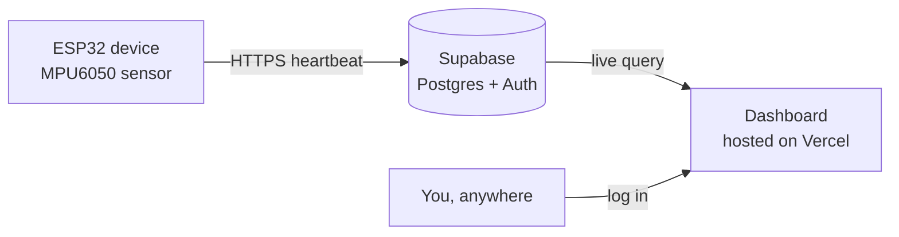

# Posture_App

[](LICENSE)

A small ESP32-based wearable that watches your upper-back angle and buzzes
when you slouch too long — plus a web dashboard where you can register
**multiple** devices, see which ones are online, and check in on your
posture from anywhere, not just your home Wi-Fi.

---

## What's in here

| Piece | What it does |
|---|---|
| **Firmware** (`/firmware`) | Runs on a Seeed XIAO ESP32-C3 + MPU6050. Calibrates to *your* upright and slouch, classifies posture in real time, and vibrates a motor when you've been slouching too long. |
| **Dashboard** (`/dashboard`) | A web app (hosted free on Vercel) where you log in, register devices, and monitor all of them — live angle, battery, online/offline status — from one screen. |
| **Backend** | [Supabase](https://supabase.com) — free Postgres database + auth. Devices push their readings here directly; no server code to run yourself. |

## How it fits together



Each device calibrates locally, then POSTs its status (angle, battery,
slouching state, timestamp) to Supabase every few seconds. The dashboard
reads that same table and marks a device **online** if it's heard from
recently, **offline** if not.

## Features

- 🧍 Learns *your* upright and slouch posture during a guided calibration
- 📳 Vibration alert that starts once you've slouched past a set delay,
  and stays on continuously until you sit back up (no timed reminders to miss)
- 🔋 Battery voltage tracking with low/critical/dead warning tiers
- 📡 Register and monitor **any number of devices** from one dashboard
- 🟢 Live online/offline status per device
- 🌐 Access your dashboard from anywhere — not tied to your home network
- 🆓 Runs entirely on free tiers (GitHub, Vercel, Supabase)

## Getting started

### 1. Hardware

- Seeed XIAO ESP32-C3
- GY-521 (MPU6050) accelerometer/gyroscope
- Vibration motor (driven through a transistor/MOSFET, not directly off the GPIO)
- Single-cell Li-ion/LiPo battery with a voltage divider into an ADC pin

Flash `firmware/arav.ino` via the Arduino IDE (board: `XIAO_ESP32C3`).

### 2. Backend (Supabase)

1. Create a free project at [supabase.com](https://supabase.com)
2. Create a `devices` table (id, name, owner_id, last_seen, plus your
   latest-reading columns)
3. Turn on Row Level Security so each user only sees their own devices

### 3. Dashboard

```bash
git clone https://github.com/Omm-Sanjog/Posture_App.git
cd Posture_App/dashboard
npm install
cp .env.example .env.local   # fill in your Supabase URL + anon key
npm run dev
```

### 4. Deploy

Push to this repo, then import it on [vercel.com](https://vercel.com) —
every push to `main` auto-deploys.

## Status

- [x] Single-device firmware: calibration, posture detection, vibration alert
- [x] Battery monitoring
- [ ] Supabase schema + auth
- [ ] Multi-device dashboard
- [ ] Firmware "phone home" rewrite
- [ ] Deployed live on Vercel

## License

MIT — see [LICENSE](LICENSE) for the full text. Free to use, modify,
and distribute, with attribution.
